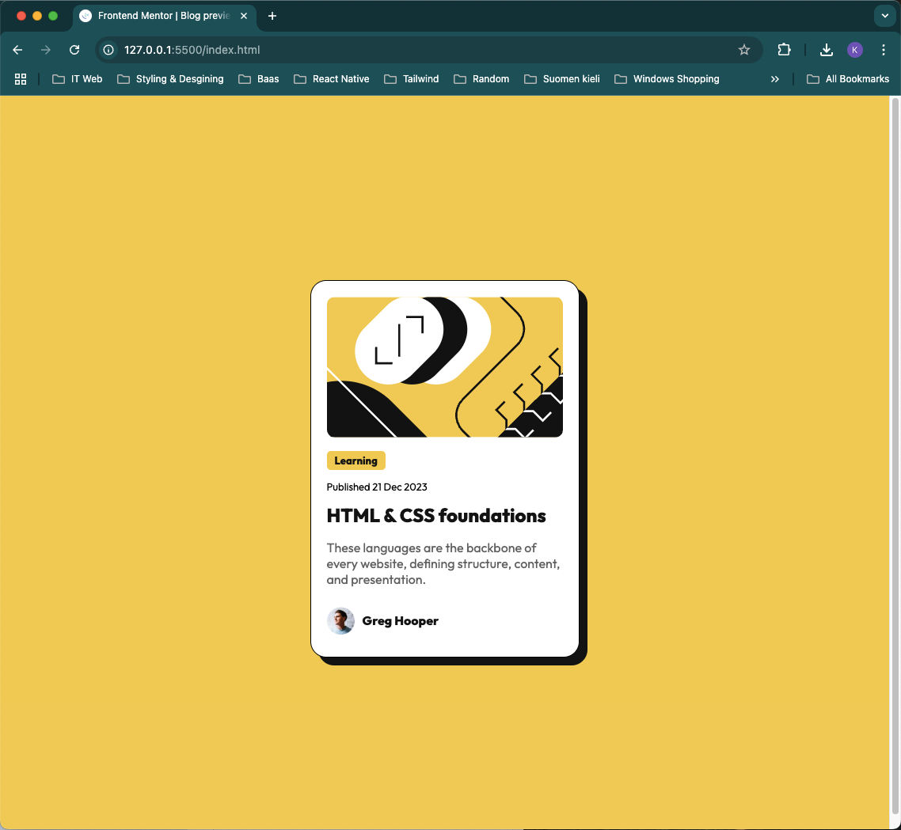

# Frontend Mentor - Blog preview card solution

This is a solution to the [Blog preview card challenge on Frontend Mentor](https://www.frontendmentor.io/challenges/blog-preview-card-ckPaj01IcS). Frontend Mentor challenges help you improve your coding skills by building realistic projects. 

## Table of contents

- [Overview](#overview)
  - [The challenge](#the-challenge)
  - [Screenshot](#screenshot)
  - [Links](#links)
- [My process](#my-process)
  - [Built with](#built-with)
  - [What I learned](#what-i-learned)
  - [Continued development](#continued-development)
  - [Useful resources](#useful-resources)
- [Author](#author)
- [Acknowledgments](#acknowledgments)


## Overview

This project is to rehearse knowledge in using HTML and CSS.


### The challenge

Users should be able to:

- See hover and focus states for all interactive elements on the page

### Screenshot




### Links

- Solution URL: [Click here](https://github.com/niophan/blog-preview-card-fe_2)
- Live Site URL: [Click here](https://niophan.github.io/blog-preview-card-fe_2/)

## My process

### Built with

- Semantic HTML5 markup
- CSS custom properties
- Flexbox
- Mobile-first workflow


### What I learned

While working through this project i recap of how to use flex, clamp and shadow-box.


```css
html {
  font-family: "Outfit", sans-serif;
  font-size: clamp(14px, 2vw, 18px);
}
.container {
  max-width: 340px;
  border: 1px solid black;
  padding: 20px;
  background: hsl(0, 0%, 100%);
  border-radius: 20px;
  display: flex;
  flex-direction: column;
  align-items: flex-start;
  box-shadow: 10px 10px hsl(0, 0%, 7%);
}
```

### Continued development

It is worth to implement a few interaction with the design.


### Useful resources

- [box-shadow](https://developer.mozilla.org/en-US/docs/Web/CSS/box-shadow)
- [clamp](https://developer.mozilla.org/en-US/docs/Web/CSS/clamp)
- [flexbox concept](https://developer.mozilla.org/en-US/docs/Web/CSS/CSS_flexible_box_layout/Basic_concepts_of_flexbox) 
- [flexbox cheatsheet](https://css-tricks.com/snippets/css/a-guide-to-flexbox/) This is an amazing document which helped me foster my understanding with flexbox. I'd recommend it to anyone still learning this concept.

## Author

- Frontend Mentor - [@niophan](https://www.frontendmentor.io/profile/niophan)
- Github - [@niophan](https://github.com/niophan)


## Acknowledgments

Thanks Frontend Mentor for this challenge.
